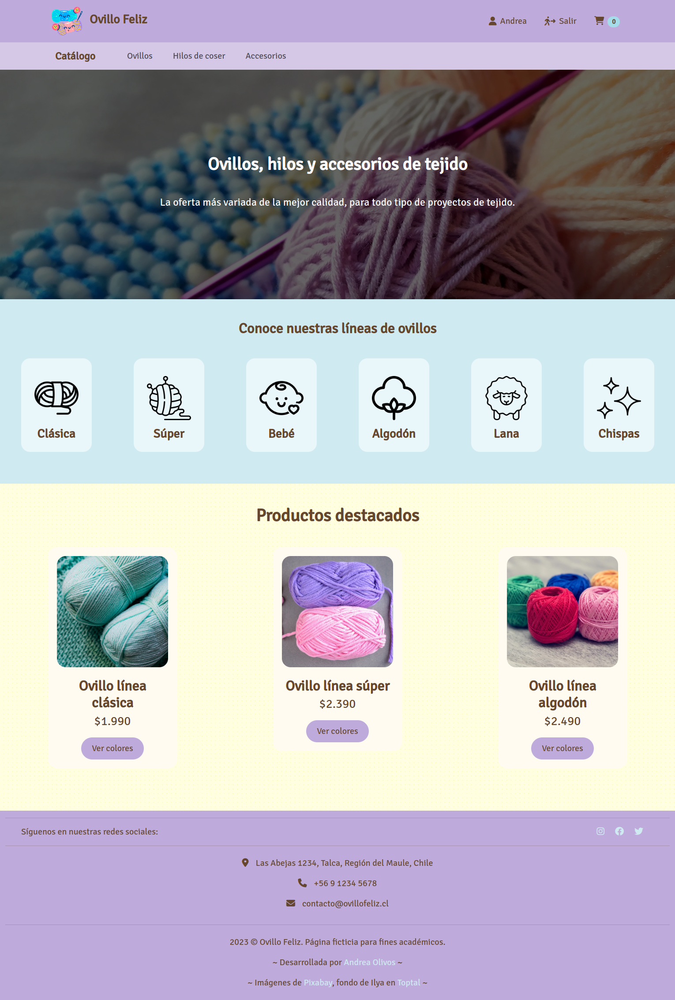
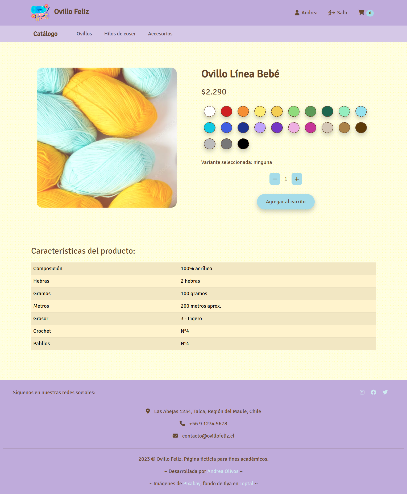
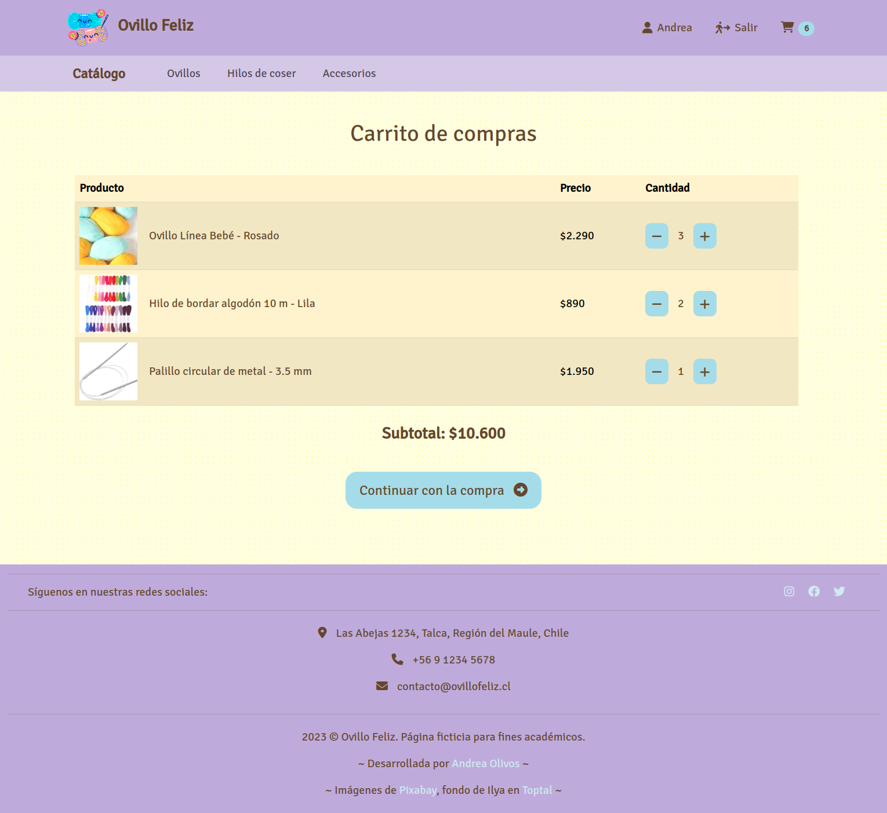
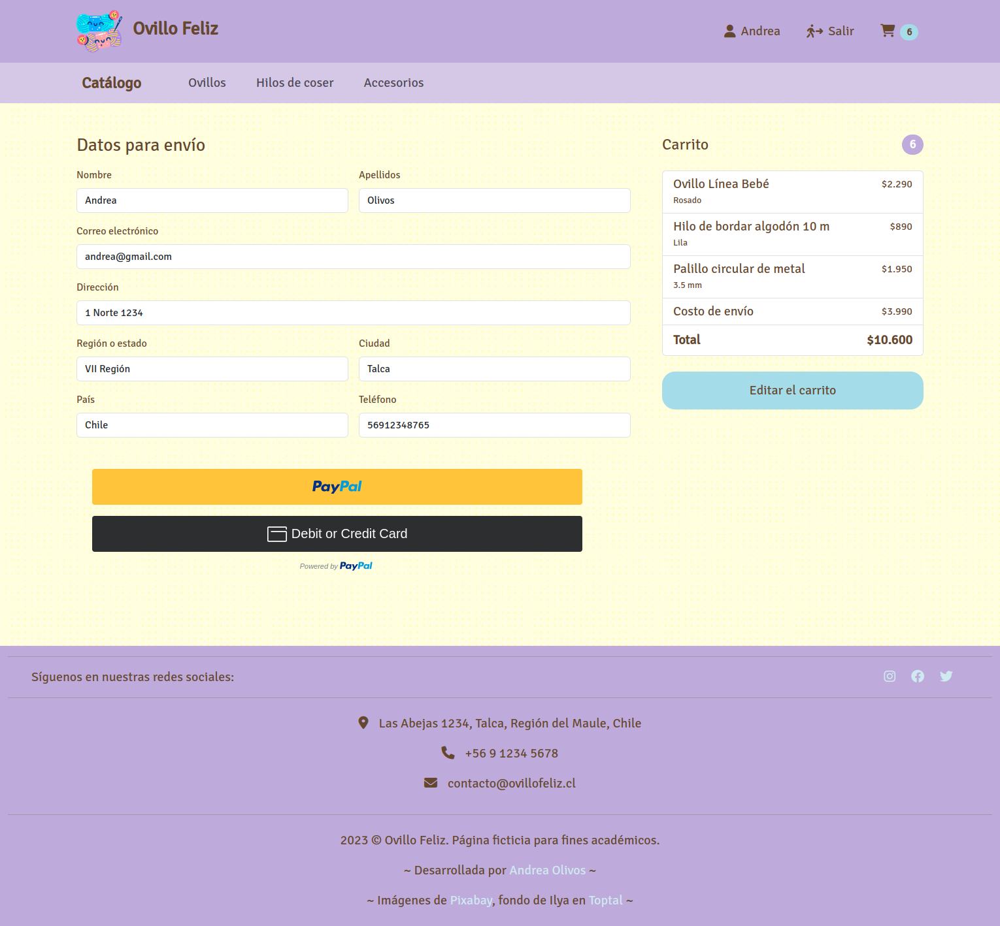

# "Ovillo Feliz" knitting supplies website

## Description

This project is a web page for a ficticious online store that sells knitting and crocheting supplies. The entire project consists of a React frontend, a [NodeJS backend](https://github.com/aolivos15/P5-ecommerce-srv), and a MongoDB database. This repo is for the frontend, and it contains a home page, catalog pages for different types of products (yarn, thread, and accessories), and individual product pages. Users can select different colors and sizes for the products, and add the ones they want to a shopping cart. There is also a checkout section with PayPal buttons to simulate a purchase. Users can also create an account and sign in to the site.

## Visuals






## Starting 🚀

These instructions will help you obtain a copy of the project and execute it on your local machine for developing and testing purposes.

### Prerequisites 📋

* Node.js
* npm

### Installation 🔧

1. Clone this repository on your local machine.

```bash
git clone https://github.com/aolivos15/P5-ecommerce.git
```

1. Navigate to the directory of the project.

```bash
cd P5-ecommerce
```

1. Install all necessary dependencies.

```bash
npm install
```

1. Start your local dev server.

```bash
npm run dev
```

1. Open [http://localhost:5173] on your browser.

## Running tests ⚙️

This project does not include automated tests. However, you can manually test all features of the app.

## Built with 🛠️

This project was built using the following tools:

* Vite - React app and its environment
* React hooks - Management of UI components
* React Router - Management of router
* React Bootstrap - Styles
* sweetalert2 - Displaying alerts
* react-paypal-js - Simulating payments
* MongoDB - Database
* Netlify - Deployment

## License 📄

This project is under the MIT license. Check the [LICENSE](LICENSE) file for more details.

## Acknowledgments 🎁

This readme file has been developed using the following project as a reference:

* [template-readme-es](https://github.com/brayandiazc/template-readme) - created by [Brayan Diaz C](https://github.com/brayandiazc)

---
⌨ ️with ❤️ by [Andrea Olivos](https://github.com/aolivos15) 😊
